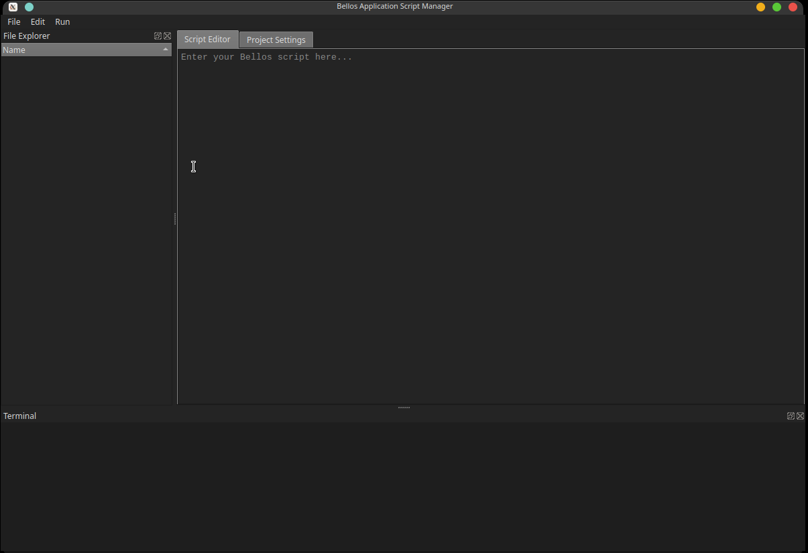

# Bellos Application Manager

Bellande Operating System Scripting Language Managing Scripts

## License
BellandeOS Scripting Language Application Manager is distributed under the [GNU General Public License v3.0](https://www.gnu.org/licenses/gpl-3.0.en.html), see [LICENSE](https://github.com/Application-Interoperability-Xenogen/bellos_application_manager/blob/main/LICENSE) and [NOTICE](https://github.com/Application-Interoperability-Xenogen/bellos_application_manager/blob/main/LICENSE) for more information.
